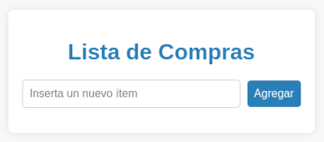
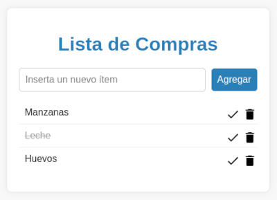

# Examen Extraordinario Pendientes
**1º DAM - LMSGI - 11 de marzo de 2025**

Haz un fork de este repositorio desde tu cuenta de GitHub, clónalo y abrelo desde el IDE que vayas a utilizar para resolver el ejercicio (Visual Studio Code, Brackets, ...)

**En este repositorio se suministran los ficheros ```index.html```, ```estilos.css``` y ```script.js```**

Para realizar este ejercicio se permite:  
- Consultar la documentación publicada en Aulas Virtuales para del Módulo de LMSGI.
- Consultar la referencia online de [MDN web docs](https://developer.mozilla.org/es/docs/Web/JavaScript).  

No está permitido:
- Consultar cualquier otra documentación.
- Consultar ejercicios resueltos en clase.
- Consultar código fuente publicado en Internet o en cualquier otro medio, independientemente del lenguaje de programación utilizado.
- Utilizar cualquier forma de inteligencia artifial para la resolución de este ejercicio.

**Ejercicio 1**

Escribir en el fichero ```script.js``` el código JavaScript necesario para crear la lista de la compra que se muestra en las imágenes siguientes:

 

Especificaciones:

- Define una función llamada ```addItem``` que se ejecute cuando se haga clic en el botón ```Agregar```. Esta función debe hacer lo siguiente:
    * Obtener el valor del input y si está vacío, mostrar un mensaje de advertencia y retornar.

    * Si el input no está vacío, crear un nuevo elemento ```<li>``` y <establecer mediante una única asignación su contenido con el texto obtenido del input seguido del código html siguiente:
    ```
    <div class="buttons">
        <span class="completeButton material-icons">done</span>   
        <span class="deleteButton material-icons">delete</span>
    </div>
    ```

    * Modifica el fragmento de código anterior para que al hacer clic sobre los elementos ```<span>``` se realicen las acciones siguientes:

        * Al pulsar sobre el primero, se debe aplicar la regla ```.completed``` definida en ```estilos.css``` al elemento ```<li>``` contendor (esto lo marcará como completado). Si se vuelve a pulsar el botón se revertira este elmento a su estado inicial.

        * Al pulsar sobre el segundo, se debe eliminar el elemento ```<li>``` contendor.

    * Añadir el elemento ```<li>``` creado al elemento ```<ul>```.

    * Limpiar el input para aceptar el siguiente item.

**Ejercicio 2**

Mediante JSON haz que la aplicación esté disponible en los idiomas español e inglés pudiendo cambiar entre estos idiomas con un select. El cambio de idioma afectará al título, al botón ```agregar``` y al selector de idioma (a su etiqueta si estuviese etiquetado y al propio selector).

## Rúbrica

**Ejercicio 1**

En el método ```addItem```:

* 1 punto: se obtiene el valor del input y se muestra la advertencia correspondiente si está vacío.

* 1 punto: se crea el elemento ```<li>``` según las especificaciones.

* 1 punto: se agrega el elemento ```<li>``` al elemento ```<ul>```.

* 1 punto: se limpia el input para aceptar el siguiente item.

En el primer elemento ```<span>```:
a
* 1 punto: se aplica la regla CSS especificada al elemento ```<li>``` contenedor cuando se pulsa sobre este elemento.

* 1,5 puntos: se revierte el elemento ```<li>``` contenedor a su estado inicial si se vuelve a pulsar sobre este elemento.

En el segundo elemento ```<span>```:

* 1 punto: se elimina el elemento ```<li>``` contenedor cuando se pulsa sobre este elemento.

**Ejercicio 2**

* 1,25 puntos: se añade un selector para cambiar el idioma.

* 1,25 puntos: se realiza correctamente el cambio de idioma.

## Entrega

Una vez finalizado el examen, comprime este repositorio en un archivo comprimido, adjúntalo a la tarea correspondiente de Aulas Virtuales y realiza la entrega.

No te olvides de guardar una copia de seguridad de tu solución haciendo un commit & push final.